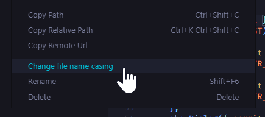
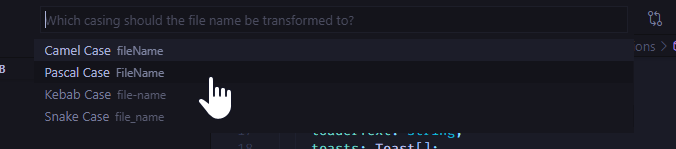

# File Explorer Casing Utils

## How to use

01. Click 'change file name casing' in the file explorer context menu:
(Tip: you can also select multiple files and folders and rename them in bulk)

02. Select the desired casing style from the dialog:

## Known Issues

Currently there are no issues known. If you encounter any issues, feel free to open a PR at https://github.com/JH1ller/file-explorer-casing-utils

## Release Notes

### 0.0.1

Initial release
